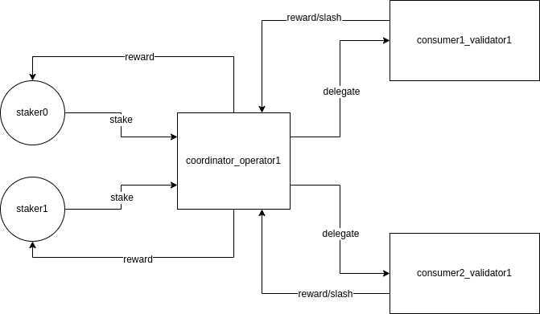

# Restaking Protocol Reward

In the restaking protocol, the operator on the coordinator collects POS staking rewards from various consumers and redistributes them to the stakers.

## Single-Chain POS Reward Distribution

First, let's provide a brief description of the reward distribution scheme for single-chain POS.

POS staking rewards come from the inflation of each block, so every active validator in each block can receive rewards based on their vote power. Since the commission rate of a validator can be changed at any time, it is necessary to calculate the rewards for both the validator and delegators based on the current commission rate at the time of rewarding. For example, if a validator receives a reward of 10 tokens in a block and has a commission rate of 20%, then 8 tokens will be distributed among all the delegators, while the validator will keep 2 tokens for themselves.

## Distributing Rewards

Each validator maintains its own period. Here, a period is not a fixed time length but is created whenever there is a change in the delegations on the validator.

A period includes three pieces of information: startBlockHeight, endBlockHeight, and rewardRatio. Additionally, each delegation includes startHeight, endBlockHeight, and startDelegateAmount, which are used to track the delegation's corresponding validator period. Whenever there is a change in the delegation, rewards are settled, and the delegation is re-initialized.

Here's a simple description of the reward distribution process:

1. A new period is created with a reward ratio of 0.
2. The reward ratio for this period is the sum of the reward ratios from the previous periods. For example, if the 0th period had 10 tokens and another staker delegates 10 tokens, which resulted in a total of 5 tokens in rewards distributed, a new period is created, and the reward ratio for the 0th period becomes 5/10 = 0.5. When another staker delegates during the 1st period and receives 8 tokens in rewards, the reward ratio for the 1st period becomes 8/(10 + 10) + 0.5 = 0.9.
3. If a staker from the 0th period withdraws their rewards at this point, the reward will be (0.9 - 0) * 10 = 9.
4. If a staker from the 1st period withdraws their rewards at this point, the reward will be (0.9 - 0.5) * 10 = 4.

## Slash

Let's assume that from the start of the blockchain, there is one validator and some delegations on it. If delegator1 and delegator2 make their staking at the 10th and 15th blocks, respectively, two periods will be formed as follows:

1. Period 0: {[0, 10)}. From the start of the validator until delegator1 makes their staking.
2. Period 1: {[10, 15)}. From the staking of delegator1 to the start of delegator2's staking.

If the validator is slashed during period 1, the total staked amount on the validator will be reduced. However, the specific delegations will not be changed (changing them might be time-consuming). Therefore, in the reward distribution after period 1, it is necessary to allocate rewards based on the actual staked amount of delegator1. In period 2, the reward for delegator1 will be calculated as period2RewardRatio * startDelegationAmount * (1 - slashFactor).

## Restaking Reward Distribution

Restaking reward distribution is akin to a composite POS system involving multiple consumers. Let's observe the current architecture:

Here are the main differences compared to a single-chain approach:

1. The staker does not directly interact with the validator.
2. Operator delegation is not real-time but occurs through scheduled tasks.
3. Reward distribution is not proactive and real-time. The operator must periodically extract rewards from the consumer.

Scheduled tasks introduce delays, meaning that the execution of transactions is not triggered at the exact time specified.

To establish rules for restaking reward distribution, consider the following:

1. Staking funds with the operator within the same delegation period are considered simultaneous stake actions. The StartTime is the beginning of the period.
2. Slash events are recorded based on timestamps rather than block heights. Consumer reports of a slash event include the quantity and factor.
3. Other calculation and recording methods remain consistent with the single-chain approach. However, restaking involves composite calculations. The difference arises from the fact that restaking operators do not obtain rewards in real-time, resulting in potentially different reward yields at different times. Nonetheless, if the interval between reward withdrawals is not significant, the impact remains minimal.