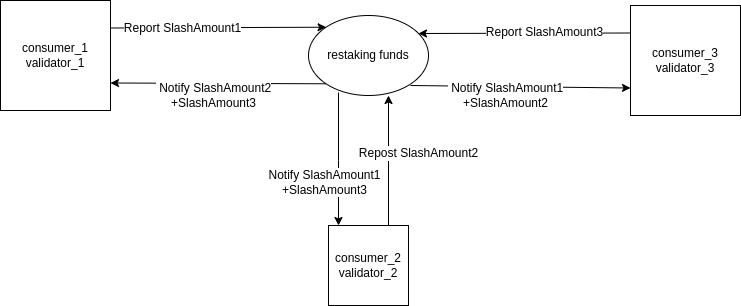

# Restaking
## Definition
### Provider
The Provider is the source chain for restaking funds and is typically chosen from well-performing chains. It introduces POS staking funds through LSD (Liquidity Staking Derivatives) or native tokens.

### Coordinator
The Coordinator serves as the central hub for restaking. It introduces funds from the Provider and connects with Consumers. It is controlled by an Operator running on it, overseeing delegate/undelegate/slash operations for the restaking funds.

### Consumer
The Consumer connects to the Coordinator, consumes the introduced funds, and distributes POS staking rewards to the providers of those funds.

### Operator
The Operator is a core role within the Restaking Protocol and is closely related to delegation, undelegation, and slashing. The Operator exists on the Coordinator. [Operator definition](https://github.com/celinium-network/restaking_protocol/blob/main/x/restaking/coordinator/types/coordinator.pb.go#L126). The Operator defines the token for restaking, records the amount of restaking, the total shares, and the validator on the consumer (each consumer can only select one validator).

Creating an Operator may require staking some funds and receiving a portion of stake rewards as an incentive. These specifics will be determined as the economic model matures. The Owner of the Operator has the authority to maintain the list of consumer validators, which may be adjusted through governance.

## Overview
### Initialization
The Restaking protocol is built on top of the IBC (Inter-Blockchain Communication) protocol. Its initialization process is closely tied to the IBC handshake. The steps for initialization are as follows:

1. The Consumer initiates a proposal on the Coordinator to add a Consumer, which includes the metadata of the Consumer Chain.
2. Once the proposal is approved, the Consumer initiates an IBC handshake.
3. The Coordinator verifies the handshake information against the proposal.
4. The Consumer sends the current Validator Set to the Coordinator.
5. The Coordinator saves the Validator Set of the Consumer.
6. Handshake is successfully completed.

### Consumer Validator Set Change
The Coordinator needs to track the creation and removal of Validators on the Consumer. Since there may be a large number of Validators on-chain, during initialization, we only select and send the Validators with block voting power. Subsequently, by tracking the creation and removal of Validators on the Consumer, we can ensure a fair opportunity for each validator to receive restaking funds. 

### Delegate
Users delegate funds to the Operator and receive shares in return. These shares are used for redemption and reward distribution. The Operator periodically notifies its consumer of the delegated funds it has received. Upon receiving this notification, the consumer informs the Multistaking module to stake the non-native tokens. Currently, Multistaking works by calculating and minting an equivalent amount of native tokens using an oracle. These minted tokens are then used for staking. The Multistaking mechanism is customizable, allowing consumers to adjust it based on their specific business requirements.

### Undelegate
When a user initiates an undelegation, their shares are burned. The Operator periodically consolidates the undelegated funds and notifies the consumer. The related delegation on the consumer side should be immediately reduced, and the Coordinator is informed of the unbonding period. On the Coordinator, the Operator generates an UnbondingEntry based on the consumer's latest unbonding time. The UnbondingEntry operates similarly to the staking mechanism in the Cosmos SDK. It is a time-ordered queue, and when the UnbondingEntry's complete time is reached, the UnbondingEntry is destroyed, and the user receives their funds.

### Slash
When a validator on the consumer side is slashed, the Restaking Consumer module receives a notification. The Restaking Consumer module sends the slash information, along with all the operators delegating to that validator, to the Coordinator. Upon receiving the slash information, the Coordinator immediately burns the corresponding tokens and notifies other consumers to modify their delegation corresponding to the Operator-Validator pair.

#### Handling Simultaneous Slashes and Link Delays
In order to ensure that restaking truly enhances the security of POS (Proof-of-Stake), it is crucial to ensure that any reported slash by a Consumer can fully reduce the funds. So, under what circumstances would it be impossible to perform a slash?

Intuitively, this occurs when the restaking funds, while processing the report's slash amount, are found to be insufficient. There are two reasons for this problem:
1. A large number of consumers report slashes at the same time, causing the total slash amount to exceed the restaking funds. The root cause of this issue is excessive restaking, which has rendered the protection of the POS system ineffective.
2. Due to delays in the link, a consumer who experiences a slash is unable to promptly report the slash information or receive slash notifications from other links in a timely manner. Consequently, they are unable to update the restaking funds promptly. This results in the calculation of future slashes based on outdated restaking funds.

##### Restaking Consumer Upper Limit
Suppose a sum of funds is restaked across N consumers, considering the scenario where a validator triggers the maximum possible punishment simultaneously.

These validators first experience downtime, entering the unbonding and jailed state, and then they are caught in a double-signing proof. As a result, the validator enters the unbonding, jailed, and tombstoned state. Once in this state, the validator loses any further opportunity for misconduct and will not receive any additional punishment.

Thus, by default, a single consumer validator may incur a maximum punishment of 5.01% at a time. Therefore, there is an upper limit on the number of consumers to which each sum of funds can be restaked (limited to 1/5.01%). This upper limit ensures that the maximum punishment for each consumer can be executed. In the case of asynchronous execution across multiple chains, this ensures that the final result is independent of the execution order.

If it is ensured that reports/notifications can be handled correctly in an unordered execution scenario, the final result will remain consistent.

##### Link Delay
Even if the downtime and double-signing punishments can be handled simultaneously, problems can still arise in the presence of delays.
Consider the following example: Funds are restaked across N consumers, reaching the limit of consumer slashes.
If Consumer 1's validator is punished due to downtime and fails to report the punishment due to delay or if the notify signal sent to other consumers is blocked after reporting, a critical situation arises. After the jail period ends, the validator comes online again, and an extreme scenario occurs. The additional downtime punishment makes it impossible to complete the punishment.

Therefore, it is essential to report the downtime punishment for Consumer 1's validator during the jail period and ensure that other consumers receive the notification. This requires that the report time + notify time < jail time.

In reality, we cannot guarantee that the link will always meet the operational conditions. We can only ensure that in the event of extreme situations, a correct recovery is possible. In the case of extreme delays, we consider the delayed validator to have incurred a slash (applying the maximum punishment for downtime + double-signing) and lock a portion of the restaking funds in advance, notifying other consumers. If communication is later restored without any slash occurring, the locked funds are released.
